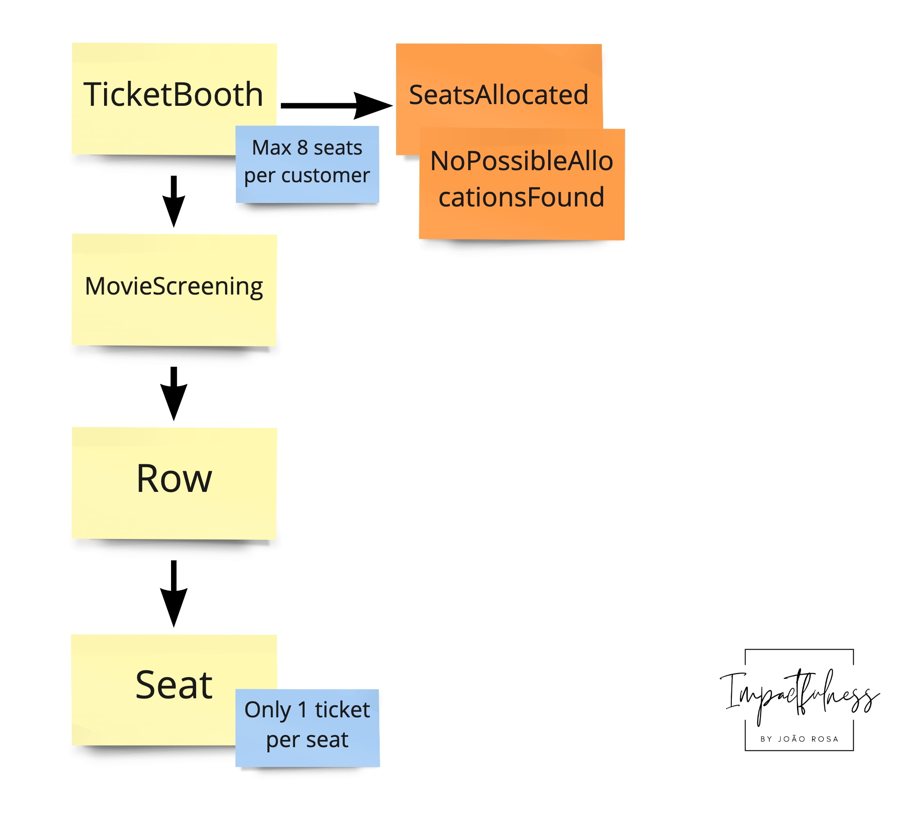

# NDC Minnesota 2022 - From EventStorming to coDDDing workshop

This repo has the code that attendees could use as a kick-start for the workshop. There are several labs, and a lab's beginning and end have their branches.

## Requirements

- .NET 6
- Your favourite IDE
- Internet connection to restore NuGet packages

## Exercises
### Lab 1

Start on the `main` branch by implementing the tests `TicketBoothShould` by doing outside-in TDD. We already set up most scaffolding with an anaemic Domain Model to help you. You can find the stubs for the MovieScreening state at `StubMovieScreening/Stubs/MovieScreenings/`. In the `StubMovieScreening/Stubs/MovieScreenings/` you can create your examples by following the JSON schema that is already there. It all comes down to the `showId` used in the tests.

We use the following naïve first design of our model to implement with outside-in TDD:

The results can be found in `lab1end`.

### Lab 2

We have added two more test to `TicketBoothShould` for you to implement. In this lab you will focus on implementing the adjacent seating rule. The model has not changed!

The result can be found in `lab2end`.

### lab 3

In lab 3 you will start implementing a ORM model that splits the data persistance model from our domain model. We do this with the ports and adapters pattern. There is a new project called `CinemaAllocations.Adapters.DataPersistence` were we need to add our code.

The result can be found in `lab3end`.